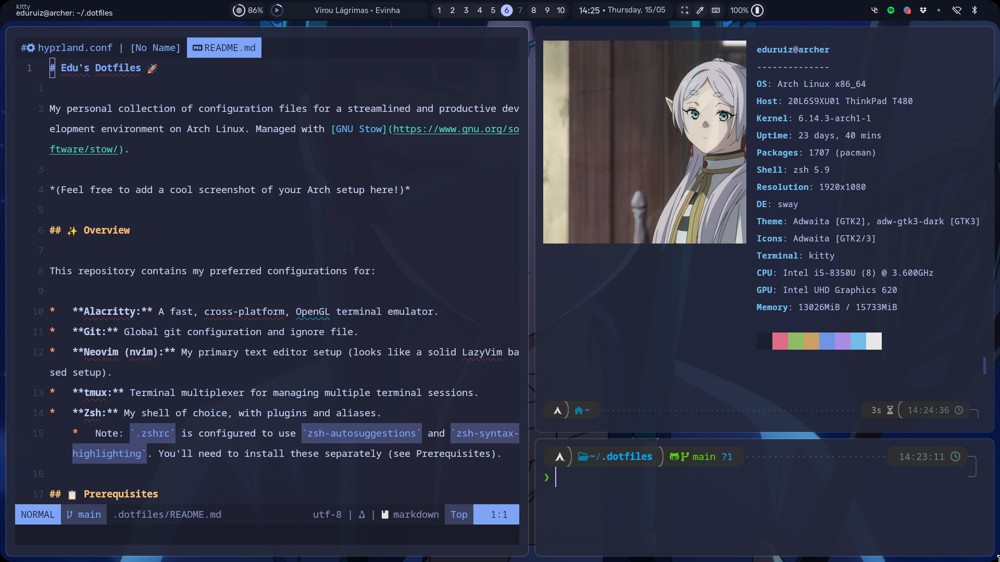

# Edu's Dotfiles 🚀

My personal collection of configuration files for a streamlined and productive development environment on Arch Linux. Managed with [GNU Stow](https://www.gnu.org/software/stow/).



## ✨ Overview

This repository contains my preferred configurations for:

*   **Alacritty:** A fast, cross-platform, OpenGL terminal emulator.
*   **Git:** Global git configuration and ignore file.
*   **Neovim (nvim):** My primary text editor setup (looks like a solid LazyVim based setup).
*   **tmux:** Terminal multiplexer for managing multiple terminal sessions.
*   **Zsh:** My shell of choice, with plugins and aliases.
    *   Note: `.zshrc` is configured to use `zsh-autosuggestions` and `zsh-syntax-highlighting`. You'll need to install these separately (see Prerequisites).

## 📋 Prerequisites

*   **Git:** For cloning the repository.
*   **GNU Stow:** For symlinking the dotfiles.
    *   On Arch Linux, you can install it with: `sudo pacman -S stow`
*   **The applications you want to configure:** (e.g., Alacritty, Neovim, tmux, Zsh).
*   **Zsh Plugins (if using Zsh config):**
    *   `zsh-autosuggestions`
    *   `zsh-syntax-highlighting`
    *   On Arch Linux, you can install them from the official repositories or AUR:
        ```bash
        sudo pacman -S zsh-autosuggestions zsh-syntax-highlighting
        ```
        *(Alternatively, you might use a Zsh plugin manager like Oh My Zsh, Antigen, Zinit, etc. Adjust as per your preference.)*
*   **(Optional but Recommended)** **A Nerd Font:** For proper icon rendering in Neovim and other tools (e.g., Fira Code Nerd Font, JetBrainsMono Nerd Font).

## ⚙️ Installation

**⚠️ Warning:** This will overwrite existing configuration files if they conflict. It's highly recommended to back up your current dotfiles (`~/.zshrc`, `~/.config/nvim`, etc.) before proceeding.

1.  **Install Prerequisites:**
    Ensure `git` and `stow` are installed. For Arch Linux:
    ```bash
    sudo pacman -S git stow
    ```
    If you plan to use the Zsh configuration, install the Zsh plugins:
    ```bash
    sudo pacman -S zsh-autosuggestions zsh-syntax-highlighting
    ```

2.  **Clone the repository:**
    ```bash
    git clone https://github.com/Eduruiz/dotfiles.git ~/.dotfiles
    ```
    *(You can clone it to any directory, but `~/.dotfiles` is a common convention.)*

3.  **Navigate into the cloned directory:**
    ```bash
    cd ~/.dotfiles
    ```

4.  **Stow the configurations:**
    To symlink all configurations:
    ```bash
    stow *
    ```
    Or, to stow specific packages (e.g., just nvim and zsh):
    ```bash
    stow nvim zsh
    ```

5.  **Restart your terminal or source your shell configuration** (e.g., `source ~/.zshrc`) for changes to take effect. For Neovim, the first launch might install plugins.

## 📦 Managing Dotfiles with Stow

GNU Stow is a symlink farm manager. It takes distinct packages of software and symlinks their files into a common directory tree. In our case, the "packages" are directories like `nvim`, `zsh`, `git`, etc., within this `.dotfiles` repository, and the "common directory tree" is your home directory (`~`).

All `stow` commands should be run from *within* your `~/.dotfiles` directory.

### Adding New Configurations (e.g., for an app called `newapp`)

Let's say you want to add configuration files for a new application called `newapp`.

1.  **Identify the target path:**
    Determine where `newapp` expects its configuration files.
    *   Example 1: `~/.newapprc`
    *   Example 2: `~/.config/newapp/config.json`

2.  **Create the corresponding directory structure inside your `~/.dotfiles` repo:**
    *   For `~/.newapprc`:
        ```bash
        cd ~/.dotfiles
        mkdir newapp
        ```
    *   For `~/.config/newapp/config.json`:
        ```bash
        cd ~/.dotfiles
        mkdir -p newapp/.config/newapp
        ```
    The `newapp` directory here is your "stow package". The structure *inside* `newapp/` must mirror the structure relative to your home directory.

3.  **Move your existing configuration file(s) into this new structure:**
    *   For `~/.newapprc`:
        ```bash
        mv ~/.newapprc ~/.dotfiles/newapp/
        ```
        Now you'll have `~/.dotfiles/newapp/.newapprc`.
    *   For `~/.config/newapp/config.json`:
        ```bash
        mv ~/.config/newapp/config.json ~/.dotfiles/newapp/.config/newapp/
        ```
        Now you'll have `~/.dotfiles/newapp/.config/newapp/config.json`.
    *(Alternatively, you can copy them and delete the originals later, or create them from scratch within the `.dotfiles` structure.)*

4.  **"Stow" the new package:**
    From your `~/.dotfiles` directory:
    ```bash
    stow newapp
    ```
    This command will create symlinks:
    *   `~/.newapprc` → `~/.dotfiles/newapp/.newapprc`
    *   `~/.config/newapp/config.json` → `~/.dotfiles/newapp/.config/newapp/config.json` (it will also create `~/.config/newapp` if it doesn't exist, and `~/.config` if needed)

5.  **Add, commit, and push the changes to your Git repository:**
    ```bash
    git add newapp
    git commit -m "Add configuration for newapp"
    git push origin main # or your default branch name
    ```

### Updating Existing Configurations

1.  Edit the configuration file directly within your `~/.dotfiles` repository (e.g., `~/.dotfiles/zsh/.zshrc`).
2.  The changes are immediate because the file in your home directory (e.g., `~/.zshrc`) is just a symlink to the one in the repository.
3.  Commit and push the changes to Git:
    ```bash
    git add zsh/.zshrc # or the specific file you changed
    git commit -m "Update Zsh configuration"
    git push origin main
    ```

### Restowing (Re-linking)

If you manually add files to a stowed package directory (e.g., add a new alias file inside `~/.dotfiles/zsh/aliases/`) or if symlinks get broken, you can "restow" the package:

```bash
stow --restow zsh
   ```


Or to restow everything:

```bash
stow --restow *
   ```

The --restow option will first "unstow" (remove symlinks) and then "stow" again, ensuring all links are fresh.

Removing a Configuration (Unstowing)

If you no longer want stow to manage a package's configuration:

Unstow the package:
From your ~/.dotfiles directory:

```bash
stow -D zsh
```
This removes the symlinks managed by stow for the zsh package (e.g., ~/.zshrc will be unlinked). Your actual configuration files remain safe within ~/.dotfiles/zsh/.

(Optional) If you want to remove the configuration from your dotfiles repository entirely:

```bash
git rm -r zsh
git commit -m "Remove zsh configuration"
git push origin main
```

🔧 Customization

Feel free to fork this repository and customize it to your heart's content!

🤝 Contributing

While these are my personal dotfiles, if you spot an error, a potential improvement, or have a suggestion, feel free to open an issue!
